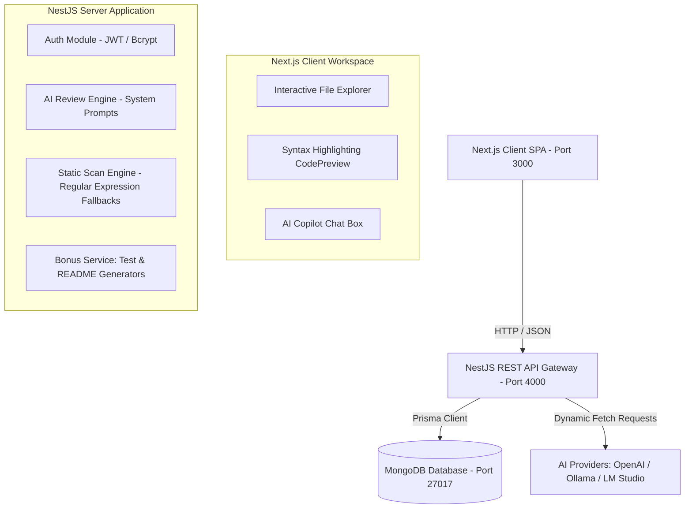

# System Architecture — Review.AI

This document outlines the software architecture, relational schema model, AI prompting data flows, and offline protection mechanisms.

---

## 🏛️ System Block Diagram



---

## 💾 Relational Schema Design (Prisma)

Although backed by **MongoDB**, collections enforce relation fields, indices, and structures:

- **User**: Stores developer name, unique email, and hashed credentials.
- **Project**: Represents a workspace repo directory created by a user.
- **File**: Contains filename, relative file paths, language codes, and code text strings.
- **Review**: Logs the results of code review runs (mode type, text summary overview).
- **Issue**: Individual vulnerability bugs detected (title, recommendation blocks, lines range).
- **AIProvider**: Customizable LLM server settings (endpoint base URL, API keys, active toggle).
- **ChatSession**: Handles conversational sessions mapping users and project references.
- **ChatMessage**: Chat message records (role text logs, user inputs).

---

## ⚙️ AI Prompt Engineering & Data Flows

### 1. Code Review Prompt Flow
When auditing code, files are concatenated into the User Prompt:

```
[System Instruction]
You are a senior code reviewer. Audit the code for category: {security | performance | quality}.
Output must be structured JSON matching:
{
  "summary": "...",
  "issues": [ { "title": "...", "description": "...", "recommendation": "...", "severity": "...", "filePath": "...", "lineStart": ... } ]
}

[User Code Context]
--- File: src/controllers/userController.ts ---
...code content...
```

### 2. Copilot Context Fetching
When the developer chats with the Copilot, the backend retrieves project file definitions. The context is limited to the relevant source file tokens and formatted to direct the LLM.

---

## 🛡️ Offline Resiliency & Fallback Layer

To ensure the assessment application is instantly operational without a running external LLM server:
1. **Connection Validation**: The Settings panel tests provider connectivity. If the server is unreachable, it logs a descriptive timeout error.
2. **Regex Static Scan Engine**: If a review request to Ollama, LM Studio, or OpenAI fails/times out, the backend immediately invokes `runStaticAnalysis()`. It runs regex patterns to detect typical security loopholes (e.g. hardcoded keys, `eval`, SQL injection concatenations), performance bottleneck blocks, and empty try-catch blocks.
3. **Template Mock Generators**: For chat dialogs, unit test synthesis, and project README generation, keyword responders and language-specific mock assert generators are loaded when offline.
